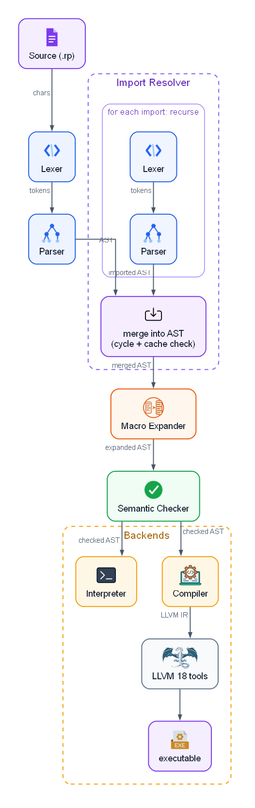

# Raptor

Raptor is a custom interpreted and compiled programming language written in Rust.

It is a strongly and statically typed language with mutable variables, scoped execution, functions, references, structs, multidimensional vectors, type conversions, and structured control flow.

The project provides **two executables**:

* `raptor` — the Raptor compiler and interpreter
* `lsp` — the Language Server Protocol (LSP) server for editor integration

## Table of contents

* [Language pipeline](#language-pipeline)
* [Executables](#executables)
* [Documentation](#documentation)
* [Quick start](#quick-start)
* [CLI options](#cli-options)
* [Example program](#example-program)
* [Language overview](#language-overview)
* [Errors and diagnostics](#errors-and-diagnostics)
* [Testing](#testing)
* [LLVM](#llvm)
* [Cargo targets](#cargo-targets)

## Language pipeline



The semantic checker performs **type checking** and other static validation before the program is interpreted or compiled, unless `--unsafe` is explicitly used.

## Executables

### `raptor`

The main Raptor command-line tool. It provides both the interpreter and the compiler, and can:

* interpret Raptor source files;
* compile Raptor programs to native executables;
* compile and immediately run programs;
* control compiler optimization levels;
* optionally skip semantic checking with `--unsafe`.

### `lsp`

The Raptor Language Server Protocol implementation. It provides language-server functionality for editors and IDEs that support LSP, allowing Raptor source files to be integrated with development environments.

The LSP server is a separate executable from the `raptor` compiler/interpreter.

## Documentation

| Component          | Documentation                                           |
| ------------------ | -------------------------------------------------------- |
| Grammar             | [docs/grammar.md](docs/grammar.md)                       |
| Lexer               | [docs/lexer.md](docs/lexer.md)                           |
| Parser              | [docs/parser.md](docs/parser.md)                         |
| Semantic Checker    | [docs/semantic-checker.md](docs/semantic-checker.md)     |
| Interpreter         | [docs/interpreter.md](docs/interpreter.md)               |
| Compiler            | [docs/compiler.md](docs/compiler.md)                     |
| Memory Management   | [docs/memory-management.md](docs/memory-management.md)   |

## Quick start

### Build

The project defines two executable targets, `raptor` and `lsp`, plus the shared `raptor_lib` library crate they're both built on.

```bash
# Build everything
cargo build --release

# Build only the compiler/interpreter
cargo build --release --bin raptor

# Build only the LSP server
cargo build --release --bin lsp
```

The resulting executables are written to `target/release/raptor` and `target/release/lsp`.

### Run a Raptor program

```bash
# Interpret (default behavior)
./target/release/raptor examples/basic.rp

# Compile to a native executable (written to build/)
./target/release/raptor --compile examples/basic.rp

# Compile and immediately run the result
./target/release/raptor --run examples/basic.rp
# equivalent to:
./target/release/raptor --compile --run examples/basic.rp
```

### Development

During development, `cargo run` builds and runs directly from source, without a separate release build:

```bash
cargo run --bin raptor -- examples/basic.rp             # interpret
cargo run --bin raptor -- --compile examples/basic.rp    # compile
cargo run --bin raptor -- --run examples/basic.rp         # compile and run
cargo run --bin lsp                                        # LSP server
```

For everyday local use, prefer building once in release mode and invoking the resulting binaries directly, as shown above — debug builds of the compiler are noticeably slower.

## CLI options

The `raptor` executable supports the following options:

```text
-h, --help          Show this help message
-v, --verbose       Show execution time of each phase
--unsafe            Skip semantic checking
--compile           Compile the source file instead of interpreting it
--run               After compiling, build and run the resulting executable (implies --compile)
-o <FILE>           Set output executable path
--link <FILE>       Link an additional object file (compilation mode only)
-O0                 No optimization (default)
-O1                 Basic optimization
-O2                 Default optimization
-O3                 Aggressive optimization
--overflow <POLICY> Integer overflow policy: ignore, warn, error
```

The compiler writes generated artifacts to `build/`.

The `lsp` executable is a separate LSP server and does not use the `raptor` command-line interface described above.

## Example program

The following program demonstrates several core Raptor features: variables, functions, references, structs, enums with payloads, pattern matching, vectors, loops, conditionals, macros and static typing.

```raptor
enum AccountStatus derives Debug {
    Active,
    Suspended(str),
    Deleted(Timestamp)
};

struct Timestamp derives Debug {
    i64 day,
    i64 month,
    i64 year
};

enum Role derives Debug {
    Admin,
    Moderator,
    User
};

struct User derives Debug {
    str name,
    AccountStatus status,
    Role role
};

fn pretty_timestamp(&Timestamp timestamp): str {
    let day = timestamp.day as str;
    if (timestamp.day < 10) day = "0" + timestamp.day as str;

    let month = timestamp.month as str;
    if (timestamp.month < 10) month = "0" + timestamp.month as str;

    return day as str + "-" + month as str + "-" + timestamp.year as str;
}

let users = [
    User {
        name: "Alice",
        status: AccountStatus::Active,
        role: Role::Admin
    },
    User {
        name: "Bob",
        status: AccountStatus::Suspended("too many failed logins"),
        role: Role::User
    },
    User {
        name: "Charlie",
        status: AccountStatus::Deleted(Timestamp { day: 17, month: 9, year: 2026 }),
        role: Role::Moderator
    }
];

let idx = 2;
match (users[idx].status) {
    AccountStatus::Deleted(timestamp) { println(pretty_timestamp(&timestamp)); },
    rest println(account_status_debug(&users[idx].status) + " doesn't contain data of type 'Timestamp'.");
}

# Equivalent to the `match` above: `if ... matches` desugars to a match with
# one arm, and `else` becomes the `rest` arm.
if (users[idx].status matches AccountStatus::Deleted(timestamp)) {
    println(pretty_timestamp(&timestamp));
} else {
    println(account_status_debug(&users[idx].status) + " doesn't contain data of type 'Timestamp'.");
}

for (let i = 0; i < vector_size(&users); i += 1) {
    println(user_debug(&users[i]));
}
```

Save the program as `examples/demo.rp`, then run it with any of:

```bash
./target/release/raptor examples/demo.rp             # interpret
./target/release/raptor --compile examples/demo.rp    # compile
./target/release/raptor --run examples/demo.rp         # compile and run
```

## Language overview

Raptor currently supports:

* `i64`, `f64`, `str`, `bool`, and `void`;
* mutable variables with block-based scoping;
* functions and recursion;
* parameters passed by value or by reference;
* structs, including fields of composite (`str`, vector, struct, enum) type;
* enums with unit variants and variants carrying payloads;
* pattern matching with `match` over enum variants;
* `if`, `for`, `while`, and `switch`;
* `break`, `continue`, and `return`;
* arithmetic, comparison, and logical operators;
* explicit casts with `as`;
* vectors, including multidimensional types such as `i64[][]` or `CustomStruct[][]`;
* built-in functions such as `print`, `input`, etc.

### Structs

Structs define custom data types composed of named fields. Each field has a statically declared type and can contain primitive values, vectors, other structs, or enums.

```raptor
struct User {
    str name,
    i64 age,
    bool active
};
```

Struct values are created using the struct name followed by field initializers:

```raptor
let user = User {
    name: "Alice",
    age: 30,
    active: true
};
```

Fields are accessed using the `.` operator:

```raptor
println(user.name);
println(user.age as str);
```

Structs can contain other user-defined types, allowing nested data structures:

```raptor
struct Address {
    str city,
    str street
};

struct User {
    str name,
    Address address
};

let user = User {
    name: "Alice",
    address: Address {
        city: "Warsaw",
        street: "Main Street"
    }
};
```

Structs can also contain vectors and enums:

```raptor
enum AccountStatus {
    Active,
    Suspended(str),
    Deleted
};

struct User {
    str name,
    AccountStatus status,
    i64[] scores
};
```

Structs can be passed to functions either by value or by reference:

```raptor
fn print_user(&User user): void {
    println(user.name);
}

let user = User {
    name: "Alice",
    age: 30,
    active: true
};

print_user(&user);
```

Structs can be stored in vectors, returned from functions, used as fields of other structs, and used as payloads of enum variants.

### Enums

Enums define a type with a fixed set of named variants. A variant can either be a **unit variant** without associated data or carry a value of a specified type.

```raptor
enum AccountStatus {
    Active,
    Suspended(str),
    Deleted
};
```

Here, `Active` and `Deleted` are unit variants, while `Suspended` carries a `str` payload.

Enum values are created using the `EnumName::Variant` syntax:

```raptor
let active = AccountStatus::Active;
let suspended = AccountStatus::Suspended("too many failed logins");
let deleted = AccountStatus::Deleted;
```

Variants can carry primitive values, structs, enums, or vectors:

```raptor
struct User {
    str name
};

enum Event {
    Login(User),
    Message(str),
    Batch(i64[])
};
```

For example:

```raptor
let event = Event::Batch([10, 20, 30]);
```

Enums are commonly inspected using `match`. Payloads can be bound directly in a match arm:

```raptor
fn status_repr(&AccountStatus status): str {
    match (status) {
        AccountStatus::Active {
            return "active";
        },
        AccountStatus::Suspended(reason) {
            return "suspended: " + reason;
        },
        AccountStatus::Deleted {
            return "deleted";
        }
    }
}
```

A match arm for a unit variant does not bind any payload, while a payload-carrying variant binds its associated value:

```raptor
match (event) {
    Event::Login(user) {
        println(user.name);
    },
    Event::Message(message) {
        println(message);
    },
    Event::Batch(values) {
        println(vector_size(&values) as str);
    }
}
```

Enum values can be stored in variables, passed to functions, returned from functions, stored in vectors, and used as fields of structs.

### Vectors

Vector types may have multiple dimensions:

```text
i64[]     # one-dimensional vector
i64[][]   # two-dimensional vector
i64[][][] # three-dimensional vector
```

When a vector is passed **by value**, the language uses a **shallow copy**: the vector's own structure is copied, while any composite elements it contains are shared, not recursively deep-copied.

### Memory management

`str`, `vectors`, `structs` and `enums` are heap-allocated and managed automatically through reference counting — there is no manual `free`/`delete` and no garbage collector pause. Assigning or passing these types follows consistent value/reference rules (e.g. strings are always deep-copied, vectors and structs are shared or shallow-copied depending on context). See [docs/memory-management.md](docs/memory-management.md) for the full model, including its current known limitations (reference cycles are not collected).


## Errors and diagnostics

Raptor diagnostics use a compact compiler-style format:

```text
error: <message>
  --> <file>:<line>:<column>
```

Different pipeline stages report different classes of errors:

* the lexer reports malformed lexical input;
* the parser reports syntax errors;
* the semantic checker performs static type checking and related validation;
* the interpreter reports runtime errors;
* the compiler reports code-generation and compilation errors.

See the individual component documentation for examples and details.

## Testing

Run the complete test suite with:

```bash
cargo test
```

The project includes unit tests for core components and integration tests for the language pipeline.

## LLVM

The native compilation pipeline currently targets **LLVM 18** and invokes `llc-18` and `clang-18`. These tools must be available on `PATH` when using `--compile` or `--run`.

The LLVM toolchain is only required for native compilation — running a program through the interpreter does not require it.

## Cargo targets

```toml
[lib]
name = "raptor_lib"
path = "src/lib.rs"

[[bin]]
name = "raptor"
path = "src/main.rs"

[[bin]]
name = "lsp"
path = "src/bin/lsp.rs"
```

```text
┌─────────────────────┐   ┌─────────────────────┐   ┌─────────────────────┐
│        raptor       │   │          lsp        │   │      raptor_lib     │
│                     │   │                     │   │                     │
│  Interpreter        │   │  Language Server    │   │  Shared library     │
│  Compiler           │   │  Protocol (LSP)     │   │  used by both       │
│  CLI                │   │                     │   │  executables        │
└─────────────────────┘   └─────────────────────┘   └─────────────────────┘
```