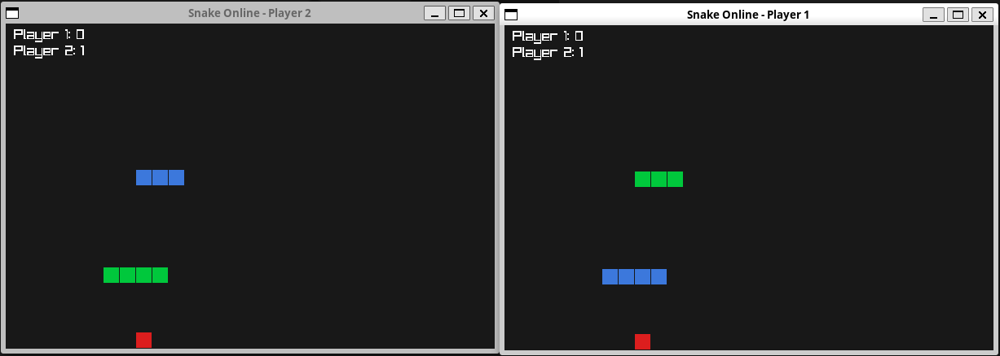

# Snake Multiplayer (Raptor + raylib)

A real-time, two-player networked Snake game, written entirely in **Raptor**
(a custom language compiled to LLVM), rendered with **raylib**, and connected
over a raw TCP protocol implemented from scratch in the language's standard
library.



## What this demonstrates

This example exercises a large part of the language end-to-end:

- **FFI to a C library (raylib)** - window creation, input polling, and
  rectangle/text rendering, all called from Raptor via `extern fn`.
- **A hand-rolled TCP client/server**, built directly on `socket` /
  `bind` / `listen` / `accept` / `connect` / `send` / `close` libc bindings
  exposed as Raptor standard-library functions (`tcp_listen`, `tcp_accept`,
  `tcp_connect`, `tcp_read`, `tcp_write`, `tcp_close`), with no external
  networking library involved.
- **A small text protocol** for game state, built using the language's
  string/vector features (`str_len`, string indexing, `str += char`,
  `vector_push`, `as str` / `as i64` casts) - no serialization library, just
  string concatenation and a hand-written parser (`split_by_delim`).
- **Two independent client processes**, each rendering its own raylib
  window, polling input locally, and syncing game state with the server once
  per frame.
- **Deterministic, seeded pseudo-random number generation** for apple
  placement (`rand_next` / `rand_range`), implemented purely in Raptor,
  since state is passed explicitly rather than mutated globally (see
  Architecture below).

Two players run **the same game world**, hosted by a single authoritative
server process: each client sends its intended direction, the server
advances the simulation (movement, collisions, apple pickup, scoring), and
broadcasts the resulting state back to whichever client asks.

## Architecture

```
                     ┌─────────────────────────────────┐
   INPUT/RESET  ───> │   server.rp (authoritative)     │
   (per request)     │  - owns full game state         │
                     │  - single-threaded, blocking    |
   world state  <─── │  - one client at a time         |
                     └─────────────────────────────────┘
                            ^                  ^
                    connect/send/read   connect/send/read
                    per frame           per frame
                            │                   │
                 ┌──────────┴─────┐   ┌─────────┴───────┐
                 │ player1.rp     │   │ player2.rp      │
                 │ (raylib window)│   │ (raylib window) │
                 └────────────────┘   └─────────────────┘
```

- **`server.rp`** owns all authoritative game state (both snakes, the apple,
  scores, game-over flag) and runs the simulation. It listens on a TCP port
  and, for every incoming request, does one full
  `accept → read → process → respond → close` cycle before accepting the
  next connection.
- **`player1.rp` / `player2.rp`** are two copies of the same client, each
  opening its own raylib window, differing only in a hardcoded `PLAYER_ID`
  (`0` or `1`). Every frame, a client sends its current direction to the
  server as a fresh, short-lived TCP connection, and receives back a
  snapshot of the entire world (both snakes, the apple, both scores,
  game-over state), which it then renders.
- **Protocol** is a single line of text per request/response, e.g.:
  ```
  client -> server:  INPUT <player_id> <dx> <dy>   |   RESET
  server -> client:  GAMEOVER:0|SCORE0:0|SCORE1:0|APPLE:x,y|SNAKE0:x,y;x,y;...|SNAKE1:x,y;...
  ```

### Why state is threaded through function arguments explicitly

Raptor functions can only see their own parameters and local variables -
there is no reading or writing of global/top-level variables from inside a
function body. As a consequence:

- Constants like `GRID_W` / `GRID_H` are passed into every function that
  needs them.
- The RNG state is explicit: `rand_range` takes a seed and returns
  `[value, new_seed]`, and callers thread the updated seed forward by hand.
- The actual movement/collision/scoring logic lives directly in the
  server's top-level request loop, rather than in a helper function, because
  it needs to read and mutate several pieces of world state at once
  (`snake0`, `snake1`, `score0`, `score1`, `apple`, `game_over`) - something
  only top-level code can do.

## Running it

Two terminals, in this order:

**Terminal 1 - start the server:**

In the root of the repo:

```bash
./examples/snake-multiplayer/run-server.sh
```

This compiles and immediately runs `server.rp`, which starts listening on
`localhost:8080` and blocks, printing debug logs for every request it
handles.

**Terminal 2 - build and launch both clients:**

In the root of the repo:

```bash
./examples/snake-multiplayer/run-clients.sh
```

This compiles `player1.rp` and `player2.rp` in parallel, then launches
`player1` in the background, waits half a second, and launches `player2` in
the foreground. Two raylib windows should appear; use the arrow keys in each
to steer that player's snake. Press `Enter` in a window after a game-over to
send a `RESET` to the server, restarting the round for both players.

## Limitations

- **The server is single-threaded and fully sequential.** It handles exactly
  one client connection at a time (`accept → read → process → respond →
  close`), with no concurrency. This is the source of the constraints below.

- **Clients must not start in perfect lockstep at a high frame rate.**
  Each client reconnects to the server from scratch every single frame
  (`connect` → `send` → `read` → `close`), driven by `SetTargetFPS`. If both
  client processes are launched at the exact same instant while targeting a
  high frame rate (e.g. 60 FPS), their frame loops tend to fall into
  lockstep - both attempting `tcp_connect` in near-identical, repeating time
  windows on every frame. Since the server can only fully service one
  connection at a time, this produces a *sustained, periodic* collision
  pattern (not a one-off race), and every `tcp_connect` call from both
  clients fails from the very first frame.

  **Mitigation in place:** `run_players.sh` staggers client startup by
  `sleep 0.5`, and the target frame rate is kept modest, giving the server
  enough time to finish each request before the next one arrives. This is a
  practical workaround, not a structural fix - it was confirmed by ruling
  out file-descriptor leaks, listen backlog size, and OS/network limits
  (raw TCP handled 100 concurrent connections via `nc` without issue), which
  narrowed the cause down specifically to client-side timing.

- **No concurrency headroom for more than two players.** Because every
  client polls the server independently, once per frame, and the server can
  only serve one request at a time, adding more simultaneous players
  increases the chance of overlapping requests and would require either a
  concurrent server or a fundamentally different connection model (see
  below) to stay reliable.

- **Reconnect-per-frame is inherently wasteful.** Every frame pays the full
  cost of a TCP handshake and teardown, rather than reusing a single
  long-lived connection. This is simple to reason about and was sufficient
  to demonstrate the language's networking and string-handling features
  end-to-end, but it is not how a production real-time multiplayer game
  would be built.

- **No reconnection/recovery handling.** If a `tcp_connect` fails (e.g. due
  to the timing issue above, or the server not yet being up), the client
  simply skips updating its world state for that frame and tries again next
  frame - there's no backoff, retry limit, or user-facing error state.

- **No bounds-checked, safe string indexing at the LLVM level.** Reading a
  character out of range of a `str` (e.g. a malformed protocol message) is
  undefined behavior in compiled code rather than a caught runtime error,
  unlike the tree-walking interpreter, which does bounds-check. The
  hand-written protocol parser assumes well-formed messages.

## Possible next steps

- Make the server concurrent (a thread - or an event loop - per accepted
  connection) so genuinely simultaneous clients can't collide, removing the
  need for the startup-staggering workaround.
- Switch from reconnect-per-frame to a single persistent connection per
  client, with the server pushing state updates rather than clients polling
  for them.
- Support more than two players by generalizing the fixed `snake0`/`snake1`
  state into a collection.